# Information Processing Labs
#### Nik Lewis, 19/01/2023

# Lab 1

Basic hex to seg display.

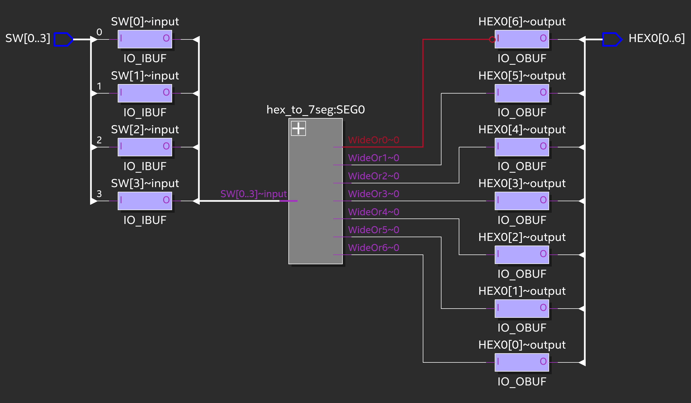

Linking to the compilation report, you can see that we have 4 `Unconstrained Input Ports` and 7 `Unconstrained Output Ports`.

The total number of port paths is _28_ = _7 * 4_. Note that the total input and output port paths are the same because all inputs and outputs go through the same single `hex_to_7seg` block.

---

### Temperature Dependency

Quartus only lets me change temperature between 85C and 0C, minimum propogation delay seems to be the same??

> Fix above, why is this the case? Expecting minimum timings to be higher for higher temperatures.

---

### Extending to 3 hex displays


Note here that the maximum number displayed is 3FF since there are only 10 pins.

Code modifications are as follows. For the last seg display, I concatenated the switches with two 0s so that the input would be 4 bits as required.  

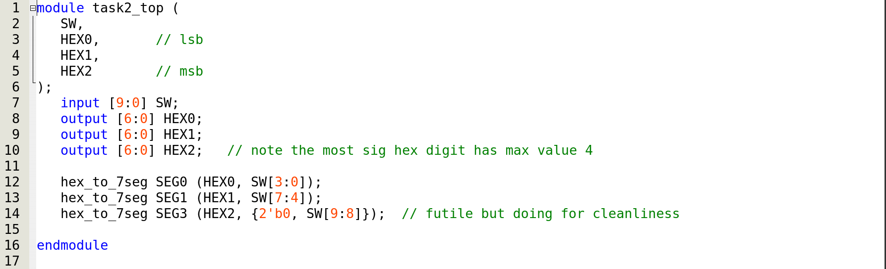

> Note that SEG0, SEG1 and SEG3 are variables storing the values of HEX0, HEX1 and HEX2. This is why the accidental typo (SEG3 should be SEG2) makes no difference, as it is still mapped to the HEX2 pin.

And the mapping changes:


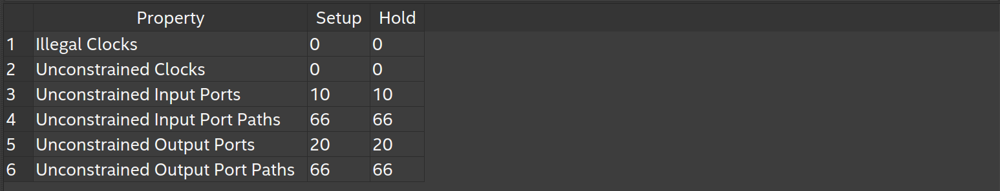

Upon inspection of the compilation report, we see that there are:

* 10 _input ports_, obviously because there are 10 switches
* 20 _output ports_, this is because I extended the HEX2 value in order to fit it into the hex_to_7seg function. I suppose this makes it "constrained".
* 66 paths, because ( 4 * 7 ) + ( 4 * 7 ) + ( 2 * 4 ) + ( 1 * 2 ) = 66

> This is just based off the diagram, it doesn't fully make sense to me. which of the last ones are unconstrained? what is going on here?

# Lab 2

### Task 1: Design a NIOS II System

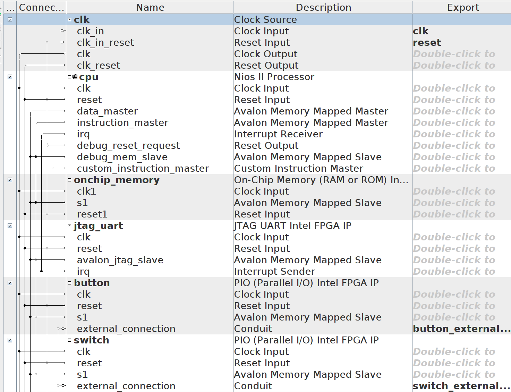


Understanding so far:

* `cpu` represents the NIOSII component. Aside from the obvious _clk_ and _reset_ connections, it has a `data_master` connection, used for communicating with various slaves. `irq` represents interrupt signals, which are sent by the `jtag_uart` component
* `jtag_uart` component is used for communication between the FPGA board and the connected device, using the UART protocol.
* button, switch, led and hex0-5 make up the periphiral I/O devices on the board.
* external connections are required to use this setup in other higher level schematics.
* `conduit` = one-to-one connection?
* `clk` is shown as a separate component because it represents the physical, oscillating crystal on board the FPGA?

> Not sure how the master/slave thing is working, might make more sense later. Is this a high-level SPI, with MOSI / MISO being defined implicitly?

#### Defining Pins:


The code above is copied from the generated `nios_setup_inst.v` into the _top file_. Note that the actual pin connections are filled in manually here.

At this poing, NIOS compiles but produces several (171) warnings. A couple that repeat are:

```
Warning (332060): Node: MAX10_CLK1_50 was determined to be a clock but was found without an associated clock assignment.
```
And
```
Warning (13024): Output pins are stuck at VCC or GND
	Warning (13410): Pin "DRAM_ADDR[0]" is stuck at GND
	Warning (13410): Pin "DRAM_ADDR[1]" is stuck at GND
	... very many other pins that we are not using
```
which I believe we can ignore at this stage.

### Task 2: Program a NIOS II System


> Insert explanation

Having programmed the FPGA with `DE10_LITE_Golden_Top.sof`, Built the project, and generated a BSP as per the instructions, we open an instance of the `nios2-terminal` using:

```bash
nios2-terminal
```
and in a _separate_ terminal window, run

```bash
nios2-download -g hello_sw.elf
```
Both from the `lab2/software/hello_sw` directory.

> insert better explanation: This monitors the JTAG UART interface i think?

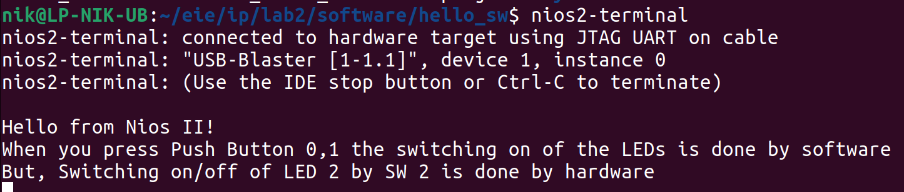

> This is wrong. Both leds are controlled by software. Nothing in DE10_LITE_Golden_Top.v to suggest otherwise. Adding the following line in Golden Top:
```verilog
assign LEDR[0] = SW[0];
```
would accomplish this. This is in the manual but has been omitted for our labs.

# Lab 3

### QSYS File:
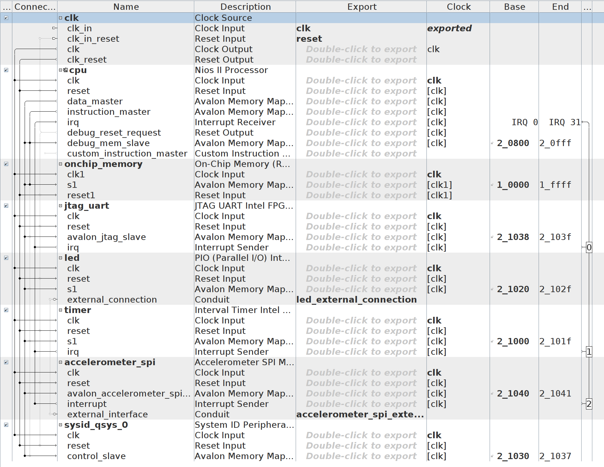
Added the `sysid_qsys_0` component as a precaution even though the instructions did not explicitly require this.

### What Project files should look like:

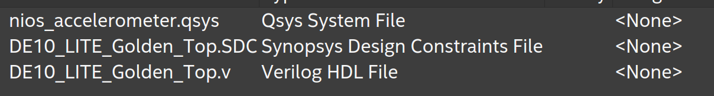
Nothing else should be present, made a mistake by accidentally adding the `bb.v` file which messed up the nios system.

### Basic C code explained:
Beginning with the definitions,
```c
#define OFFSET -32
#define PWM_PERIOD 16

alt_8 pwm = 0;
alt_u8 led;
int level;
```
* `OFFSET` - manually offsetting the accelerometer so that the middle LEDs light up at the equilibrium position.
* `PWM_PERIOD` - the count for the "on" portion of the PWM duty cycle.
* `pwm` - dummy variable to keep track of the current point in the duty cycle
* `led` - value of the top 3 bits of the accelerometer reading
* `level` - value of the 6 LSBs

LED Functions:

```c
void led_write(alt_u8 led_pattern) {
    IOWR(LED_BASE, 0, led_pattern);
}

void convert_read(alt_32 acc_read, int * level, alt_u8 * led) {
    acc_read += OFFSET; // calibrate
    alt_u8 val = (acc_read >> 6) & 0x07;
    * led = (8 >> val) | (8 << (8 - val));
    * level = (acc_read >> 1) & 0x1f;
}
```
* `led_write` - self explanatory
* `convert_read` - calibrates the accelerometer reading, extracts the required bits for `led` and `level`

> TODO: how, do not understand the bit shifts here.

Interrupt Service Routine:
```c
void sys_timer_isr() {
	IOWR_ALTERA_AVALON_TIMER_STATUS(TIMER_BASE, 0);

  if (pwm < abs(level)) {
		if (level < 0) {
    		led_write(led << 1); // shift LEDs left one
    	} else {
            led_write(led >> 1); // shift LEDs right one
        }
    } else {
        led_write(led); // keep same LED display
    }
    if (pwm > PWM_PERIOD) {
        pwm = 0; // reset pwm once reaches period
    } else {
        pwm++;
    }
}
```
> TODO: wtf is going on hereeeeee, why are we comparing pwm to the level, if they are both constantly changing??

Finally, the `main()` function:

```c
int main() {
    alt_32 x_read;
    alt_up_accelerometer_spi_dev * acc_dev;
    acc_dev = alt_up_accelerometer_spi_open_dev("/dev/accelerometer_spi");
    if (acc_dev == NULL) {
	// if return 1, check if the spi ip name is "accelerometer_spi"
        return 1;
    }

    timer_init(sys_timer_isr); // set the isr
    while (1) {

        alt_up_accelerometer_spi_read_x_axis(acc_dev, & x_read);
        alt_printf("raw data: %x\n", x_read);
        convert_read(x_read, & level, & led);
    }
    return 0;
}
```
* Defines `x_read` as an `alt_32` integer type, which is a lighter _Altera_ version of a 32-bit integer designed for the FPGA board.
* Creates pointer to `acc_dev`, a location to the _SPI_ connection.
* Sets ISR (timer_init function not shown)
* Loops infinitely, reading the accelerometer value, printing it and converting + displaying.

## N-Tap FIR Filter:
First, begin by creating a rudeimentary FIR function for an N-Tap filter:

```c
alt_32 fir(float coeffs[], alt_32 raw_data[], int n){
	float y = 0; // output

	for (; n > 0; n--){
		alt_printf("n value: %x\n", (alt_32)(n-1));
		// multiply each input by corresponding coefficient
		y += coeffs[n-1]*(float)raw_data[n-1];
	}
	return (alt_32) y; // cast back to alt_32
}
```
> TODO: The print statement here makes it run smoother? not sure why, but without the `alt_printf` here the LEDs are far laggier.

Note that the calculations need to be done in `float` format, so we cast the _raw_data_ array to `float` and then recast back to `alt_32` after.

Modifications to `main()` function included adding new definitions...

```c
float fir_coeffs[] = {0.00464135470656760, 	0.00737747226463043,
			-0.00240768675012549,	-0.00711018685736960,
			0.00326564674118811, ... }; // many more FIR coeffs

int n = sizeof(fir_coeffs)/sizeof(fir_coeffs[0]); 	// len of coeff array
alt_32 x_read[n]; 					// raw data array
alt_32 y; 						// filtered output
```
... and inside the while loop, implementing a shift register ...

```c
while (1) {
	// shift register
	for (int i = 0; i < n; i++){
		x_read[i+1] = x_read[i];
	}

	// update accel value
	alt_up_accelerometer_spi_read_x_axis(acc_dev, & x_read[0]);

	// filter output
	y = fir(fir_coeffs, x_read, n);

	alt_printf("y value: %x\n", y);
	convert_read(y, & level, & led);
}
```
> TODO: Maybe pass y by reference, and change the shift register array to a queue, using enqueue and dequeue() functions.

The coefficients were for the following LPF designed in matlab:

```bash
lpFilt = designfilt('lowpassfir', 'PassbandFrequency', 300, 'StopbandFrequency', 350, 'PassbandRipple', 0.5, 'StopbandAttenuation', 65, 'SampleRate', 1e3);
```
With transfer function:

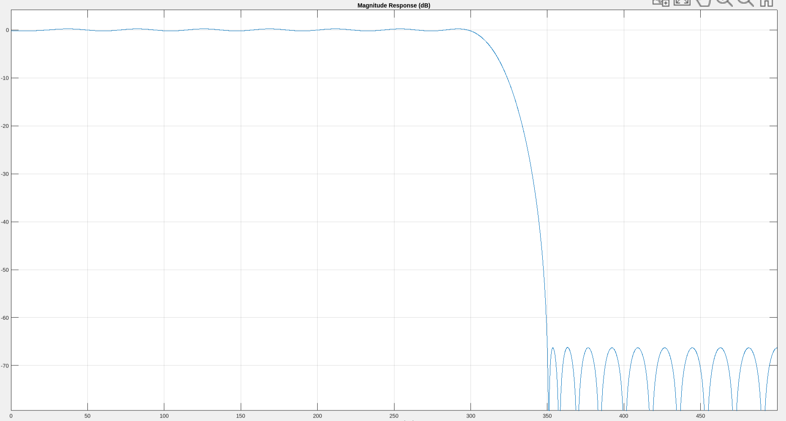

## Challenge: Optimizing the FIR using quantization

### Experimenting with Quantizing the filter:

First we must quantize the coefficents:
```c
alt_32 int_coeffs[n];

for(int j = 0; j < n; j++){
  int_coeffs[j] = (alt_32)round(fir_coeffs[j]*100000); // populate quantized coeffs
  // multiplying by 10^m to grab m of the decimal places
}
```
Where the `round` function, included in `<math.h>`, rounds to the nearest integer.

We then define a new function, `fir_quantized`, which takes in quantized coefficients and performs integer arithmetic. This is pretty much the same code, except we return:

```c
return round(y/100000);
```
To reverse the quantisation.

### Timing number of Ticks

The instructions provided in the lab did not work. Instead of using the `sys/times.h` library, we used the altera `sys/alt_timestamp.h` library. This requires the definition
```c
#define ALT_TIMESTAMP_CLK TIMER
```
> TIMER is the name of our Interval Timer in the .qsys file

Then inside the `main()` function, first create two variables for storing the start and end time respectively:
```c
alt_u64 start_time;
alt_u64 end_time;
```
> I used unsigned 64-bit integers because clock ticks are large numbers, perhaps 32 bits would also be sound.

and (before entering the loop) call the

```c
alt_timestamp_start();
```
function. This initialises the timer, otherwise you will get undefined behaviour. Getting starting and ending times can then be done using

```c
start_time = alt_timestamp();
// .. code you're timing ..
end_time = alt_timestamp();
```
and printed using:
```c
printf("Number of ticks: %llu \n", end_time - start_time);
```
Where `%llu` is for `long long unsigned` integers, which is exactly what we have. Note that this is `printf`, not it's Altera cousin `alt_printf`!!!

> NOTE: For whatever reason, this prevents the LEDs from being updated. The accelerometer is still being read from - printing the `y` value you will see it changing as you tilt the board exactly as before. Not sure why this is happening, don't care.

By changing the **while** loop to a finite **for** loop, we can time for _10000 cycles_ and divide by _10000_ to get the ticks per cycle. We repeat this 5 times for the **float coefficients FIR** and find the average:

> Note this is for a 49-tap filter !!

| 10000 cycles | take 1 | take 2 | take 2 | take 4 | take 5 | Average |
|:--------:|:------------:|:----:|:---:|:---:|:---:|:---:|
| **time** | 429496.72 | 429496.72 |429496.72 | 429496.72|429496.72 | **429496.72**|

As expected, the value does not change after re-building and re-running the program.

Investigating this for fixed point calculations:

|Number of fixed points| 1 | 2 | 3 | 4 | 5 | 6 | 7 | 8 | 9 |
|:-------:|:---:|:---:|:---:|:---:|:---:|:---:|:---:|:---:|:---:|
|**n ticks / cycle** |15681.48|51798.25|53073.87|63463.16|68689.56|75182.78|83018.50|76558.83|85246.56|

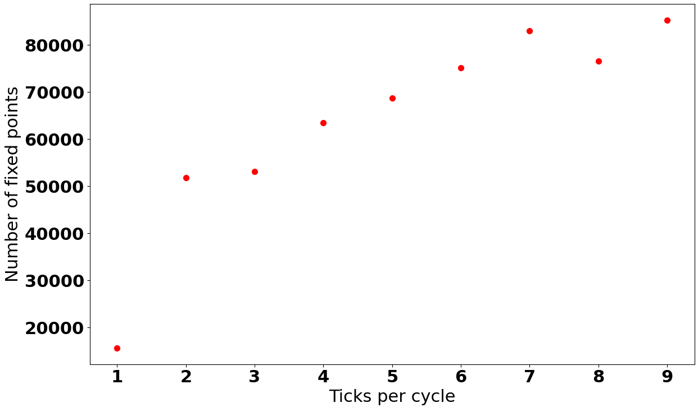

There is a sharp increase from 1 points to 2, but the number of clock cycles starts to plateau around 7-9 fixed points.

### Observing the effect on the transfer function
Using matlab, we can see the effect on the transfer function for:

#### 1 fixed point
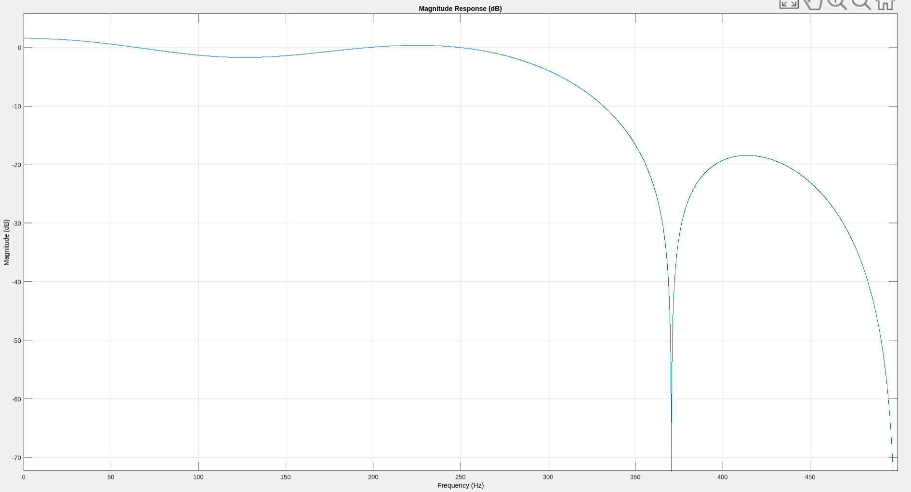

#### 2 fixed points
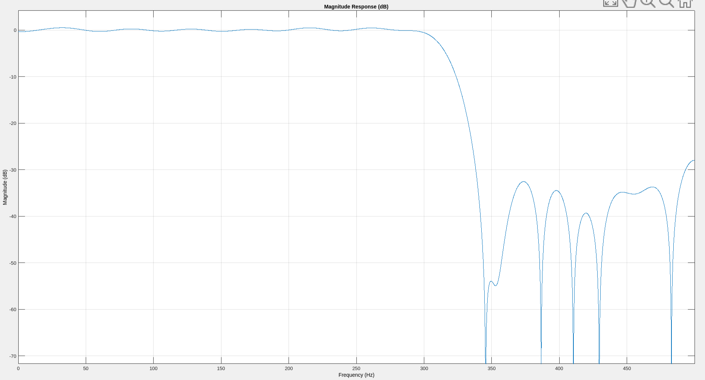

#### 3 fixed points
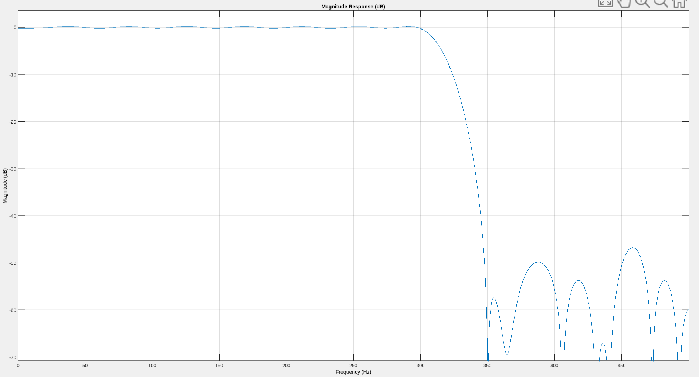

> TODO: explain

#### 5 fixed points:
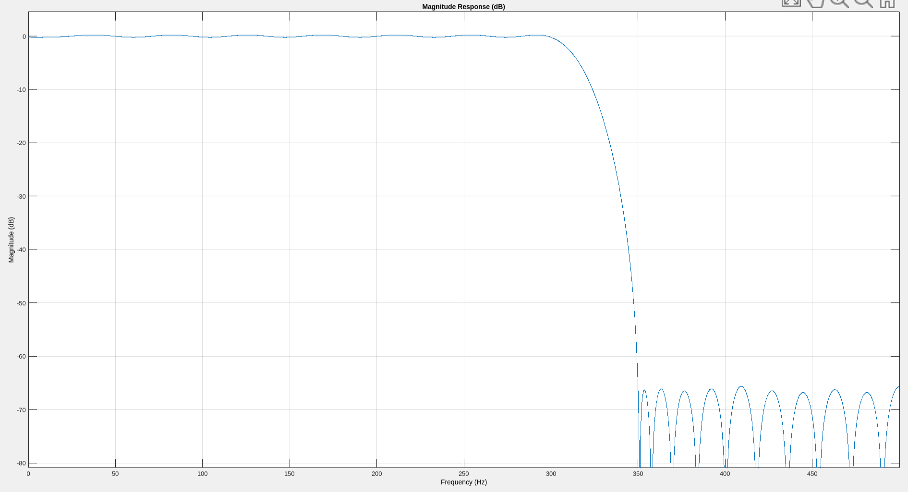

around 5dp the transfer function is almost indistinguishable.

> TODO: summarise optimisation - fewer cycles. Take video.
> TODO: Embed video of FPGA

can see evidence of it working:

[](https://asciinema.org/a/ZPjhEmmEe0faKd05vbNGKYROj)

# Lab 4

## Task 1: UART communication with a host PC

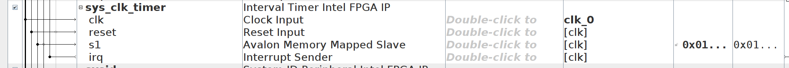
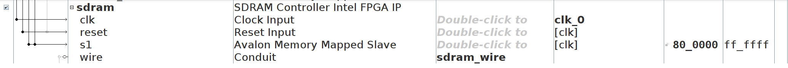
these are the only two observable differences inside the qsys file

understood.

## Task 2: Extending Lab 3 Design

First problem is that we are unable to load the task1 test code onto the lab3 program. The following error is returned:

```
Verify failed between address 0x800000 and 0x80FFFF
Leaving target processor paused
```
Which indicates that there is not enough memory onboard the DE10 to store our program. We solve this by building our Lab3 design on top of the Lab4 qsys file, which has an SRAM component - NO. ADDED MORE MEM IN FPGA, SHOW SPECS ETC AND CHANGE IN QSYS. REGEN BSP AND NEW PROJECT

no small library shit (image)

added sys clock ? ns why

accel was lagging with uart, testing using this:

```c
while(1) {
    	for (alt_u8 j = 0, j < 200, j++){
				// ... do accelerometer stuff 200 times
			}
			if (fp) {
				fprintf(fp, "Count: %x\n", tmp);
				tmp++;
			}
    	}
```
[](https://asciinema.org/a/hkniESpOh9yXT892Dk5O3r3Eh)

This ran smoothly, so we can conclude that it is the `getc()` function that is hanging the program and making the accelerometer buggy, when there is nothing in the `prompt` buffer.

#### 2 Options for solution:
1. Only open the `/dev/jtag_uart` file when you want to read, read one character, then close it.
2. Constantly populate the uart chain with an arbitrary character

> The problem with the first option is that it requires precise timing - the host's character must be present in `fp` when the program checks. If it isn't, and `fp` is closed, then the character will be lost. Also, there is a delay in opening and closing the file constantly.

> We tried option two - as long as we held down a character on the keyboard, the accelerometer ran flawlessly and the characters were being processed in real-time!

#### Design Decision:
Host will keep the `jtag_uart` connection filled with an arbitrary character until it wants to send a control signal.

Got host to do subprocess stuff:

```python
import time
import threading
import readchar
from pexpect.popen_spawn import PopenSpawn as newprocess
import pexpect

control = str # init a global, not too concerned about memory on the host side.

def get_input():
	global control
	while True:
		control = str(readchar.readchar())
		time.sleep(0.1)

def main():
    	global control
    	control = "a"
    	logs = open('logs.txt', 'w')
    	process = newprocess('nios2-terminal')
    	t2 = threading.Thread(target=get_input)
    	t2.setDaemon(True)
    	t2.start()
    	while True:
    		print('control: ' + control)
    		if control in ['0', '1']:
    			print("### SENDING CONTROL SIGNAL: " + control + ' ###')
    			for i in range(5):
    				process.send(control)	# send a pulse of 5 control signals just in case
    				time.sleep(0.1)
    			control = 'a'			# reset to usual value
    		elif control == 'q':
    			return 0
    		else:
    			process.send('a')
    			time.sleep(0.1) 	

if __name__ == '__main__':
    main()
```

[](https://asciinema.org/a/Nod7UjUjg0WvbGyF41Rygd8g8)

Fully working:
[](https://asciinema.org/a/00fZlZct5aZ7zJvEdsYN79uJL)

# Appendix
---

## Constantly expanding list of bug fixes because intel cannot write software but hey at least i don't have a mac

### Fix for NIOS II SBT not booting up in eclipse

There are two reasons for why the NIOS II link in quartus does not initially work. Firstly, the instructions in

```bash
<quartus_install_dir>/nios2eds/bin/README.txt
```

need to be followed to install the nios2 plugins. Following this, the `eclipse-nios2` script will boot a _very_ degenerate version of eclipse (see next point).

Secondly, and far less obviously, the version of `GTK` used for the `cpp` version of eclipse (as opposed to the java version installed by the `snap` package manager) is not the default. As a result, the following environmental variable needs to be exported in `.bashrc`:

```bash
export SWT_GTK3=0 eclipse
```

> full credit to Omar Alkhatib for spending a whole day finding this.

Following this, eclipse must be run from the executable in _nios2eds/bin/eclipse-nios2_. Creating symbolic link is recommended.

### Fix for Platform Designer (QSYS) not scaling for High DPI displays

Set the environmental variable:

```bash
export QSYS_FONTSIZE=28
```
>This is the only solution, as Platform Designer does not use GNOME, nor responds to any changes in java variables (despite clearly making use of jdk for many of it's subcomponents), such as:
>```bash
java -Dsun.java2d.uiScale=2.5 -Dswing.aatext=true -Dis.hidpi=true
>```
All had no effect.

### Fix for no template options in Eclipse Project Wizard

Can work around this by using the `nios` command shell. Begin by creating an instance of the shell:

```bash
~/intelFPGA/nios2eds$ ./nios2_command_shell.sh
```
By setting the font size in the console to the minimum and screengrabbing at the exact correct moment, I was able to catch all the arguments passed to create a template of the `hello_world_small` project.

```bash
 nios2-swexample-create --sopc-file=/home/nik/eie/ip/lab2/nios_setup.sopcinfo --type=hello_world_small --elf-name=hello_sw.elf --app-dir=software/hello_sw --bsp-dir=software/hello_sw_bsp
```
> The above should be run from the project directory, i.e. /eie/ip/lab2 in my case

```bash
./create-this-bsp --cpu-name cpu --no-make
```
> This is run from the lab2/software/hello_world_bsp directory that will have been created by the previous command. It's only contents will be the `create-this-bsp` shell script.

Also run

```bash
./create-this-app
```
from _lab2/software/hello_sw_ if for some reason the nios script didn't trigger it.

Finally import both the `hello_sw` and `hello_sw_bsp` into eclipse.

> Go File > Import > Import Nios II Software Project > (path to software/hello_sw), then again for the hello_sw_bsp folder.

### Fix for JTAG board not responding despite being shown as connected by `lsusb`

First, `udev` rules for usb-blasting on ubuntu 22.04 need to be changed to the following:

```bash
SUBSYSTEM=="usb", ATTRS{idVendor}=="09fb",
ATTRS{idProduct}=="6001", GROUP="plugdev", MODE="0666",
SYMLINK+="usbblaster"
```
> Credit to Omar Alkhatib for finding the above

and saved in the `udev` directory as `37-usbblaster.rules`

Following this, _in theory_ you should be able to

1. Unplug the JTAG board, and restart the udev rules:
```bash
sudo service udev restart
```
2. Kill all existing `jtagd` processes
```bash
killall jtagd
```

3. Plug the board back in and run:
```
jtagconfig
```
Which should identify the serial number of the Altera device. The `jtagconfig` command may cry about some "unable to connect to server" nonsense but as long as it finds the serial number this is ok.

HOWEVER this usually only works 1 out of 10 times, and I find the only 100% accurate fix as the following script, which will run the jtag command twice first, allowing it to timeout after 1 second:

```bash
#!/bin/bash
# credits to omar alkhatib

killall jtagd
timeout 1s jtagconfig # this will fail, cancelling it in 1 second

killall jtagd
timeout 1s jtagconfig # and again bc idek why

echo "Please disconnect board..."

while true
do
  if [ -z "$(lsusb | grep Altera)" ] # checking that there is no connection
  then
    break
  fi
done

echo "Restarting udev service..."

sudo service udev restart
sleep 1

echo "Please reconnect board..."

while [ -z "$(lsusb | grep Altera)" ]  # checks for connection present
do
  sleep 0.1s
done

echo "JTAG board found."

jtagconfig
```

And the board is correctly identified :)

## Lab4Task2 Full code

### Host:

```python
import time
import threading
import readchar
from pexpect.popen_spawn import PopenSpawn as newprocess
import pexpect
import shutup
import os

control = str # init a global, not too concerned about memory on the host side.

def get_input():
    global control
    while True:
        control = str(readchar.readchar())
        time.sleep(0.1)    

def main():

    shutup.please() # blocks deprecation warnings

    os.system("echo 'NIOS II Host Controller' | lolcat -F 0.6")
    print("-----------------------------------------------\n")
    print("Press 1 to enable filtering, 0 for raw accelerometer data. Press q to quit\n")
    print("-----------------------------------------------\n")

    global control
    control = "a"

    process = newprocess('nios2-terminal') # init the nios2-terminal shell

    t2 = threading.Thread(target=get_input) # init the character reading thread
    t2.setDaemon(True) # shouldn't prevent program from closing
    t2.start()

    while True:
        if control in ['0', '1']:
            print(">> sending control signal: " + control)
            for i in range(5):
                process.send(control)    # send a pulse of 5 control signals just in case
                time.sleep(0.1)
            control = 'a'            # reset to usual value
        elif control == 'q':
            return 0
        else:
            process.send('a')
            time.sleep(0.1)     

if __name__ == '__main__':
    main()

```

### NIOS (modifications, full code not shown):

```c
while(1) {

    	for(alt_u8 j = 0; j < 200; j++){
    		// shift register
			for (int i = 0; i < n; i++){
				x_read[i+1] = x_read[i];
			}

			// update accel value
			alt_up_accelerometer_spi_read_x_axis(acc_dev, & x_read[0]);
			// filter output

			if (mode == 1) {
				y = fir_quantized(int_coeffs, x_read, n);
			} else if (mode == 0) {
				y = x_read[0];
			}
			//alt_printf("y value: %x\n", y);

			convert_read(y, & level, & led);
    		}

    	if (fp) {
    		prompt = getc(fp);
    		fprintf(fp, "<--> Detected the character %c <--> \n", prompt);
    		if (prompt == '1') {
    			mode = 1;
    		} else if (prompt == '0') {
    			mode = 0;
    		}

    	}
    }
```
