<div id="top"/>

# Information Processing Lab
Steven Shao, 27/01/2023

* [Lab 1](#lab1)
* [Lab 2](#lab2)
* [Lab 3](#lab3)
* [Lab 5](#lab5)
* [Lab 6](#lab6)

<div id="lab1"/>

# [Lab 1](#top)
## Task 0
Nothing special to talk about for the first part. Mainly for us to install Quartus.

## Task 1: 7-Segment LED Display
Following the steps from the guide pdf, we completed the 7-segment display. The four switches on the FPGA board are the input to the CPU and the HEX display is the output.

### Design flow of Quartus Project:

1. Creating verilog modules for the projects (submodules)
2. Creating top level module / combining submodules together 
>Remember to include submodules into the project
3. Pin assignment (A file is provided that all pins on the FPGA board are assigned) 
>Note: the name in the pin assignment file should be the names to use in the top level module. (e.g. SW for switches, HEX0 for the first display)
4. Compiling the file (a .sof file is produced when the compile is successful)
5. Tools/Programer: add the .sof inside the box and press start to download the project onto the board.

## Task 2
__Question 1: Explain what you find and link this back to the compilation report.__
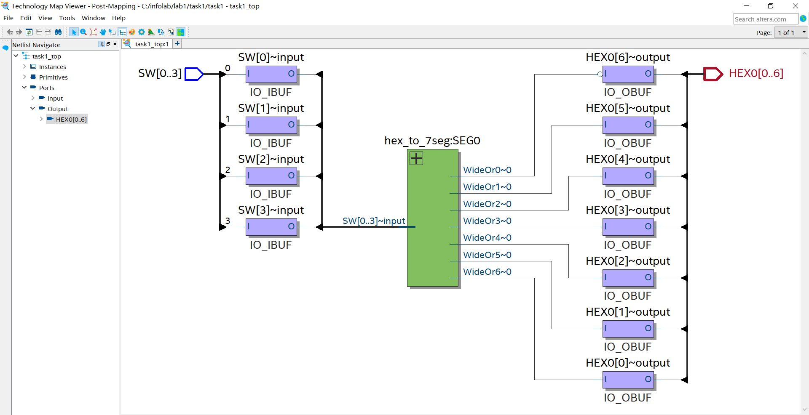
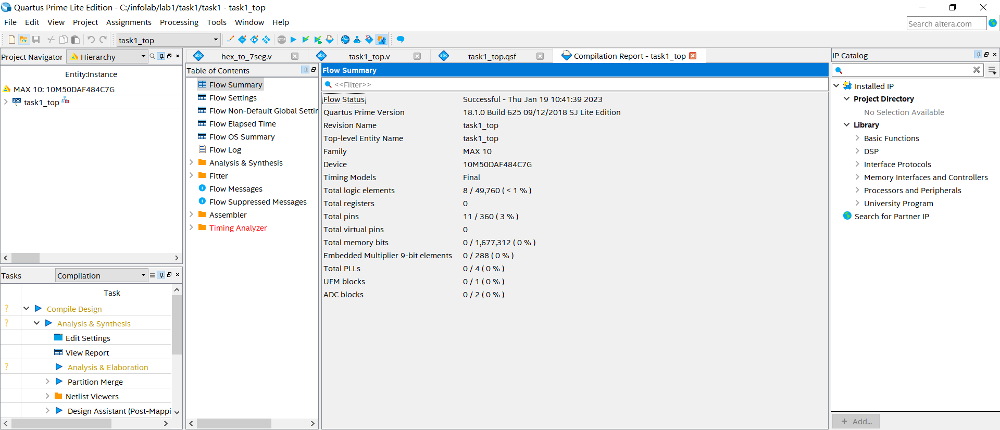

The graphical view of the synthesized design shows 4 inputs and 7 outputs (11 unconstrained ports/ 11 pins in total), which links to the compilation report.
>Q: what is Total logic elements?

__Question 2: Study the results of delay at differnet temperature and explain why?__
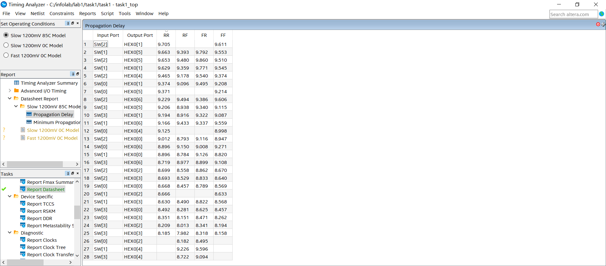
Minimum propogation delay at 85C is given in the graph above. The report at other tempertures are unavailable due to technical issues. Expecting minimum timings to be higher for higher temperatures.

__Question 3: Create own design to display all 10-bit switches on three displays__


I mainly changed the top-level file to include 10-bit input SW and three 7-bit outputs HEX0/HEX1/HEX2. Keep in mind that the input and output names should match the pin assignment file. In addition, I implemented three hex-to-7seg and make sure the inputs to these submodules are the corresponding bits from SW. Since the input is only 10-bit, I concatenated the input to the last submodule with two 0s so that the input would be 4 bits as required.


The mapping:
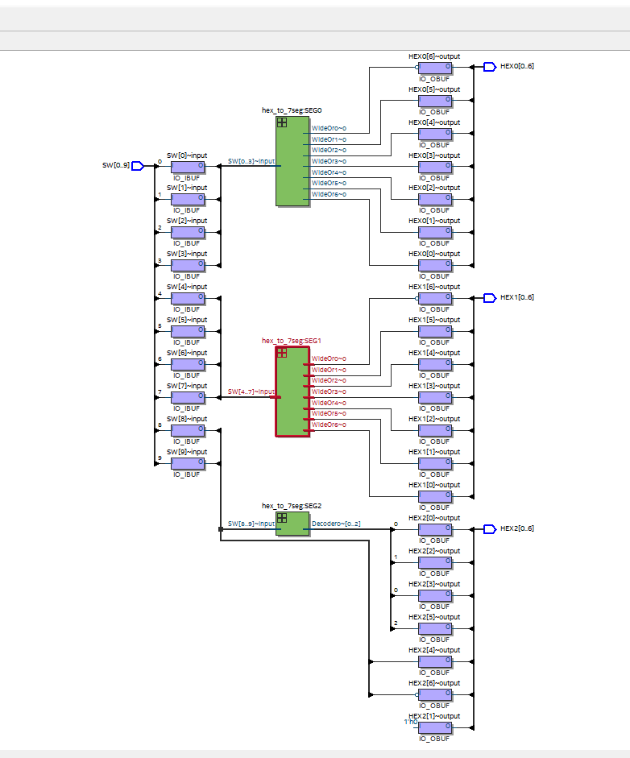


<div id="lab2"/>

# [Lab 2](#top)
## Task 1 Design a NIOS II System
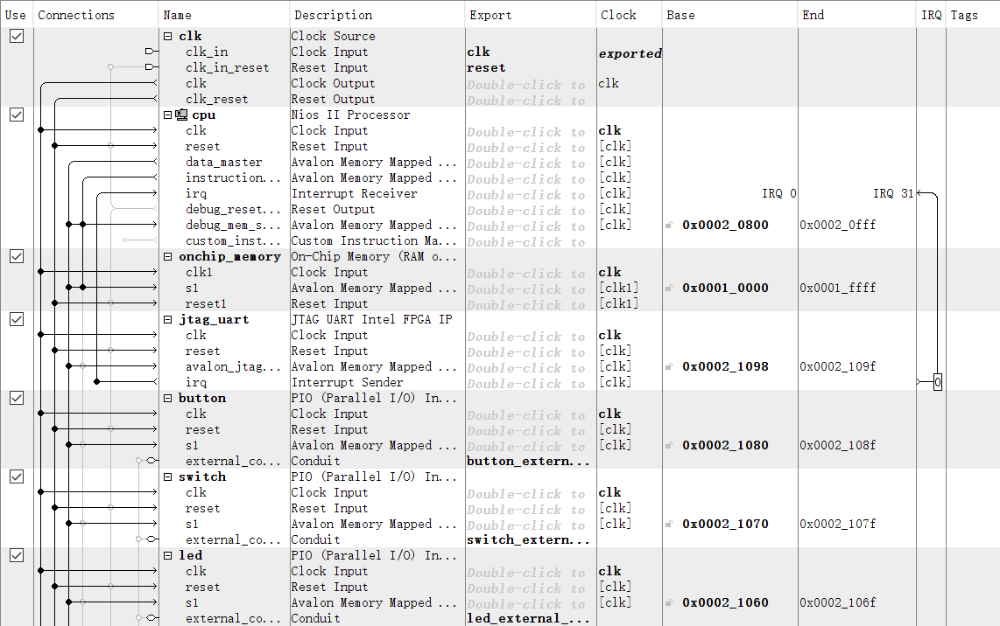
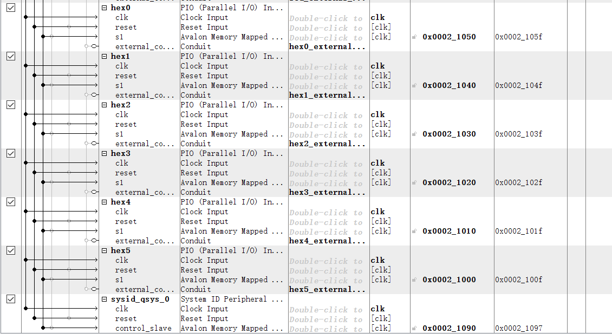

In task 1, we use Plat Designer Tools in Quartus. Inside the tools, we can use the pre-existing subblocks to assemble a processor. 

* `clk` is a fixed block in every design. It contains the clk and reset line, which are connected with all other synchronous components

* `cpu` Nios II CPU has `data_master`, which is used to communicate with other software components. `instruction_master`is connected with onchip memory, because all instructions are stored inside the memory.

* `jtag_uart` is a debug component, which seems to show any error on the PC terminal using UART protocol. The protocol is a one to one communication method. It uses the USB cable to communicate.

* `switch` `led` `HEX0` etc. are PIOs, hardware components on the FPGA board.

* `external port` are used to connect the outputs to higher level design.

### Design flow of NIOS II System:
1. Drag all components into the design (CPU, Memory, PIOs ...)
2. Connect all lines among all related components
3. `System/Assign Base Address`
> Don't know what base address means?
4. Save as a `.qsy` file
5. Right click `cpu` and `select Vectors` tab, set `reset vector memory` and `exception vector memory` to `onchip_memory.s1`
6. Save the design and click on `Generate HDL`
> HDL: hardware description language: `.v`file, auto-generated from `.qsy`, which contains the description of top-level connections.

### Defining pins:
The HDL file `nios_setup_inst.v` generated the top level connection code that should copy into the top file and modify to match the defined output names inside the top files.


After that, we can compile the qsy file. This will generate a `.sof` file which can then input into the FPGA board.

## Task 2 Software Design
Use `Tools/Nios II Software build tools for Eclipse` to code our software design in C.

### Software Programming Work Flow:
1. Open Eclipse and Create new `Nios II Application and BSP from Template`
2. Navigate to click on the `.sopcinfo `
> `.sopcinfo` file is generated from `.qsy` design, which includes the corresponding include file that can be used in the software design file?
3. Select `Hello_World_Small`. The small project make sureenough memory in FPGA
4. Change `hello_world_small.c` to any `.c` file we like to implement.
5. Right click `hello_world_small_bsp` and select `Generate BSP`
6. Right click `hello_world_small` and select `Build Project`
7. A `.elf` file will generate after successful building process. This file is saved under `/home/lab/task/software/hello_world_small`.

This is the `.c` file we would like to run on Nios II processor:


The program will print "Hello from Nios II!" on the terminal. LED will turn on when button is pressed.

> ? quite not understanding what the code inside the file means ? 

### Downloading the Program and show on PC terminal
In this task, we will run the following .c program in Nios II processor.
1. Open Nios shell from `.bat file` located inside the folder where Nios II is installed in the first place.
> The instruction pdf said to open from terminal by typing shell is only available for linux, not windows
2. Go to the directory where the project is located `cd .../software/hello_word_sw` and type in `nios2-download -g hello_world_sw.elf`. This downloads the .elf file onto the FPGA board to run the compiled C code on the NIOS II processor.
3. Open another terminal and type in `nios2-terminal` to open up a terminal window connected to the nios2.
4. The program will now run on the second terminal

This is what we got aftering following through the step: (Hello from Nios II!)


The LED is lighting up when the button is pressed:


<div id="lab3"/>

# [Lab 3](#top)
## Task 1: Interface an accelerometer to a NIOS II system

What we did in this part is two create a system that include an extra Accelerometer SPI module that acts as a slave to the data master of the CPU. It gives the accelerometer's data as the CPU requires it.

We then used the `led_accelerometer_main.c` file to drive the project. The LED on the FPGA board represents the extent of tilt by lighting up the LEDS correspondingly.

## Task 2: Understanding the code
Main function:
```c
int main() {

    alt_32 x_read;
    alt_up_accelerometer_spi_dev * acc_dev;
    acc_dev = alt_up_accelerometer_spi_open_dev("/dev/accelerometer_spi");
    if (acc_dev == NULL) { // if return 1, check if the spi ip name is "accelerometer_spi"
        return 1;
    }

    timer_init(sys_timer_isr);

    //enter while loop
    while (1) {

        alt_up_accelerometer_spi_read_x_axis(acc_dev, & x_read); // read x value from the accelerometer
        // alt_printf("raw data: %x\n", x_read);
        convert_read(x_read, & level, & led);
        // x read = 9 bits  level = 6 LSB  led = 3 MSB
        // convert_read function use pulse width modulation to create a smooth effect on the LEDs

    }
    return 0;
}
```
- `acc_dev` is more like a file that contains the accelerometer data.
- `sys_timer_isr` is an interrupt service routine that is executed when a 
specific interrupt is received. As such, the processor will only execute lighting up the LEDs at a specific intervals, letting the processor to focus on the execution of the while-loop code.
- `alt_up_accelerometer_spi_read_x_axis()` reads the x_value data from `acc_dev` into `x_read` 
- `x_read` is a alt_32 variable, but it is defined with only 9 bits in 2's complement format. The 9 bits data reflects the accelerometer value.
- `convert_read()` function converts 9-bits x_value into `led` and `level`. `led` takes the top 3 bits, `level` captures the value of the 6 LSBs.

```c
void convert_read(alt_32 acc_read, int * level, alt_u8 * led) {
    acc_read += OFFSET; // calibrate
    alt_u8 val = (acc_read >> 6) & 0x07;
    * led = (8 >> val) | (8 << (8 - val));
    * level = (acc_read >> 1) & 0x1f;
}
```
The function adds the value of the constant `OFFSET` to the `acc_read` argument. It then shifts the result to the right by 6 bits and masks it with `0x07` or `0b111` to get a value `val`. `val` is therefore the MSB 3 bits after calibration.

'led' seems to be a bitwise or combined with some kind of shifting operation. It right shifts the value `8 or 0b1111` by `val` , left shifts the value `0b1111` by `0b1111-val` and bitwise or them. This seems to create a value of mostly 1 but zero at the point where the bits of the two shifted values are both 0. Remember that the LEDS are lighted up at `0` instead of `1`. The entire operation turns the value of `val` (top 3 bits of acc_read) into a number of a series of 1s with 0 in the middle where the location of 0 depends on `val`.

`level` reprents the bit 1-5 of `acc_read` because the value comes from `acc_read` right shifted by 1 bit and mask with '0x1f/0b11111'.

```c
void sys_timer_isr() {
	IOWR_ALTERA_AVALON_TIMER_STATUS(TIMER_BASE, 0);

  if (pwm < abs(level)) {
		if (level < 0) {
    		led_write(led << 1); // shift LEDs left one
    	} else {
            led_write(led >> 1); // shift LEDs right one
        }
    } else {
        led_write(led); // keep same LED display
    }
    if (pwm > PWM_PERIOD) {
        pwm = 0; // reset pwm once reaches period
    } else {
        pwm++;
    }
}
```
> not sure how this interrupt and lighting up code works

Use `alt_printf("raw data: %x\n", x_read);` , we can print on the host terminal the actual values of the x_read.

> actual value picture

## Task 3: Implement an FIR filter to process the data

A FIR filter can only be discrete due to data being processed at intervals determined by clock cycles and instructions, so we can model the discrete filter using difference equation.

y[n] = h[n]*x[n]    `(* means convolution)`


y[n] = $\sum_{k=0}^{N} h[k]x[n-k]$, where N is the tap numbers

### 5-Tap filter: Create a moving average of every 5 inputs.

Within the while loop, we created the following code to act as a query. The input array updates the value by shifting the old values to the right and adding the new reading at the beginning

```c
void update_xread(alt_32* x, alt_32* x_read, int taps){
    for (int i = taps-1; i>0; i--){
        x[i] = x[i-1];
    }
    x[0] = *x_read;
}
```
In the filter function, every element in the `input array` is converted into float number and multiply with the element in the `COEFF array` and add all of them into a `sum`. The sum is the converted into `alt_32 type output`. 

> Note: the reason of converting into an `alt_32 type` value is because the nios2 terminal cannot print float type. 

```c
while (1) {
    	alt_32 input[N];
        alt_up_accelerometer_spi_read_x_axis(acc_dev, & x_read); 
        // read x value from the accelerometer

        update_xread(input, x_read, N+1);
        
        alt_32 output;
		output = filter(input);
        alt_printf("raw data: %x\n", output);

        convert_read(output, & level, & led);
        // x_read = 9 bits  level = 6 LSB  led = 3 MSB
        // convert_read function use pulse width modulation to create a smooth effect on the LEDs

    }
```
### From 5 tab filter to N tab filter
The code is the same as previous example. Simply change the pre-defined value of N and COEFF array into the new values.

Moving average (5-tab):
```c
//Manually input the following
#define N 5
float COEFF[N] = {0.2,0.2,0.2,0.2,0.2};
```

20-tab:
```c
//Manually input the following
#define N 20
float COEFF[N] = {0.0052,-0.0529,0.0102,0.0264,-0.0495,0.0151,0.0657,-0.1146,0.0164,0.5423,
0.5423,0.0164,-0.1146,0.0657,0.0151,-0.0495,0.0264,0.0102,-0.0529,0.0052};
```

### Design low-pass filter from MATLAB:
The code of designing a 5-Tap Filter of passband frequency of 300 is the following:

```c
lp=designfilt('lowpassfir','FilterOrder',4,'PassbandFrequency',300,'StopbandFrequency',350,'SampleRate',1000); 

// design a filter under lp  filter tab = filter order +1 

lp.Coefficients //print all coefficients

```

The output coeffients are:
```
ans =   -0.1196    0.4105    0.7344    0.4105   -0.1196 // output coefficients 
```

The coeffients are then used in the COEFF array. 

For N-tap Filter, just change the filter order to N-1.

> Filter order = number of taps-1 because: The filter order of a digital filter is defined as the highest power of the denominator polynomial in the transfer function of the filter, which defines the complexity of the filter, while the number of coefficients in the denominator polynomial is called the "taps" of the filter. 

>The filter order is equal to the number of taps minus one, because the denominator polynomial is of order n when it has n+1 coefficients.

### Challenge: Optimize the FIR
__As the number of taps increases, the time taken for the execution of the filtering function increases linearly because NIOS II does not have support for floating point operation.As such, the sampling rate of the accelerometer decreases.__

One way to increase the performance of the system is to consider converting the floating-point operations to fixed point ones.

We defined two functions:
```c
#define SHIFTING_BIT 5

alt_32 float_to_fp(float flt){
    return (alt_32)round(flt * (float)(1 << SHIFTING_BIT));
}

float fp_to_float(alt_32 fix){
    return ((float)fix / (float)(1 << SHIFTING_BIT));
}
```
`float_to_fp` converts floating point to an alt_32 fixed point number by shifting the bits to the left, similar to multiplying by 2^n power, and then rounding the number. This ensures that n bits after decimal places are preserved.

`fp_to_float` converts an alt_32 fixed point number into float by right shifting the fix point number and convert back into float. 

Both functions chops up some information. The first function excludes the information of bits after the decimal place from `round()`. The second function ignores right most bits from shifting.

> round() function is inside <math.h> that needs to be included at first.

Filter function is changed to the following:
```c
alt_32 filter(alt_32 input[N]) {
	alt_32 a =0;
    float output = 0;
    for (int i = 0; i < N; i++) {
    	a += input[i] * float_to_fp(COEFF[i]);
    }
    output = fp_to_float(a);
    return (alt_32)output;
}
```

### Timing number of Ticks (Contributor: Nik Lewis)

The instructions provided in the lab did not work. Instead of using the `sys/times.h` library, we used the altera `sys/alt_timestamp.h` library. This requires the definition
```c
#define ALT_TIMESTAMP_CLK TIMER
```
> TIMER is the name of our Interval Timer in the .qsys file

Then inside the `main()` function, first create two variables for storing the start and end time respectively:
```c
alt_u64 start_time;
alt_u64 end_time;
```
> I used unsigned 64-bit integers because clock ticks are large numbers, perhaps 32 bits would also be sound.

and (before entering the loop) call the

```c
alt_timestamp_start();
```
function. This initialises the timer, otherwise you will get undefined behaviour. Getting starting and ending times can then be done using

```c
start_time = alt_timestamp();
// .. code you're timing ..
end_time = alt_timestamp();
```
and printed using:
```c
printf("Number of ticks: %llu \n", end_time - start_time);
```
Where `%llu` is for `long long unsigned` integers, which is exactly what we have. Note that this is `printf`, not it's Altera cousin `alt_printf`!!!

> NOTE: For whatever reason, this prevents the LEDs from being updated. The accelerometer is still being read from - printing the `y` value you will see it changing as you tilt the board exactly as before. Not sure why this is happening, don't care.

> `alt_timestamp_start()` mess up with `timer_init(sys_timer_isr)`. The latter one interrupts the main function and convert x_read into LED readings at certain interval.

<div id="lab5"/>

# [Lab 5](#top)
### Installing an EC2 instance
EC2 stands for Elastic Compute Cloud. It gives you access to a virtual computer on the cloud. We can run many useful applications, including your own programs, on your EC2 instance.

Following the guide to build an EC2 instance. Here are some Important choices we made when create the instance:

- ubuntu server
- t2.micro processor, free tier processor that is enought for our small project
- key pair .ppk file. It is a private key, which is used as a password to login to the remote system
- Network setting: Security group is set to All TCP, which means all users can login and interact with the instance without security layer. This makes the instance less secure, but no one wants to hack our student project.
- Create an IAM profile of DynamoDB. This allows our EC2 instance to communicate with DynmoDB. The IAM profile is created by Amazon for users to specify what kind of service to include in the instance. Amazon doesn't want every instance to be accessible to every service.

After launching the instance, a public IP address will be generated. For our local machine to connect to our EC2 instance, it will need to use the public IPv4 address – in this case, 54.210.203.6.

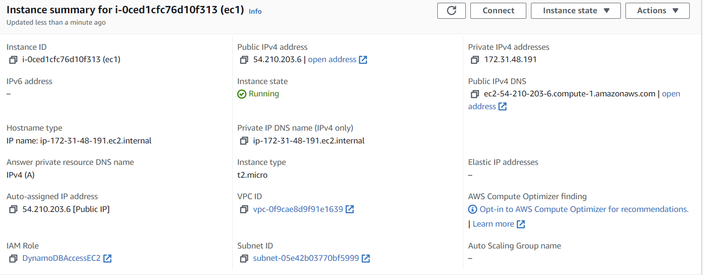

### Communicating with the EC2 instance
The PuTTY application (second from the bottom) is the terminal emulator that lets us run Linux commands on our remote Ubuntu based EC2 instance.

- Host Name = public IP address
- SSH include `.ppk` file, which acts as password
- After the terminal is open, login by enter ubuntu (this is the default username)


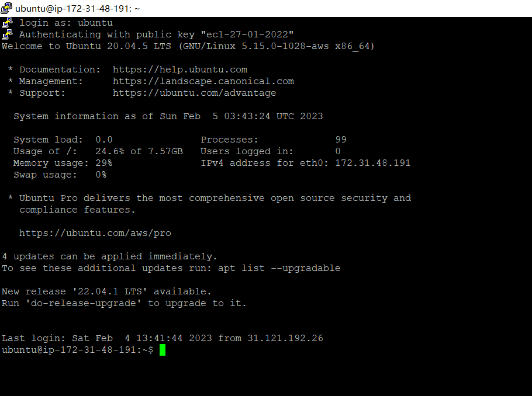

__Install Python on the EC2 instance__
`$ sudo apt install python 3.8`

__Once python is installed, we can check by running__
```c
$python3   // this will take you inside Python terminal
>>> 3+5    // hitting enter will show you the result
>>> exit() // hitting enter will exit from Python
```

### Moving files to the server using FileZilla
With python installed, we are now able to execute python code on our EC2 instance, but it is easy to program the python code on local machine and then move to the instance. FileZilla can help move the file.

- File - SiteManager
- enter public IPv4 DNS of EC2 instance
- upload `.ppk` key file

This helps FileZilla to connect local PC with EC2 instance. The file can be transfered simply by dragging.

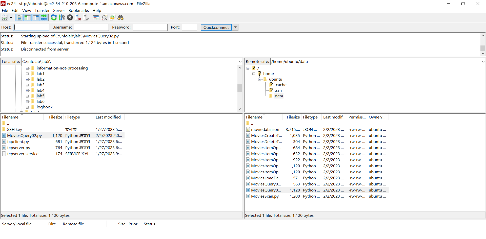

### Running TCP Server on the EC2 instance
TCP server-side code:
```py
import socket
print("We're in tcp server...");

#select a server port
server_port = 12000

#create a welcoming socket
welcome_socket = socket.socket(socket.AF_INET, socket.SOCK_STREAM)

#bind the server to the localhost at port server_port
welcome_socket.bind(('0.0.0.0',server_port))
welcome_socket.listen(1)

#ready message
print('Server running on port ', server_port)

#Now the main server loop
while True:
    connection_socket, caddr = welcome_socket.accept()
    #notice recv and send instead of recvto and sendto
    cmsg = connection_socket.recv(1024) 
    cmsg = cmsg.decode()
    if(cmsg.isalnum() == False):
        cmsg = "Not alphanumeric.";
    else:
        cmsg = "Alphanumeric";
    connection_socket.send(cmsg.encode())
```
> Notice the IP address 0.0.0.0 used in the bind() function. When we wrote the same code on our 
local computer, we used the address 127.0.0.1 (i.e. ‘localhost’). This is the IP address assigned 
to the "loopback" or local-only interface. This is a ‘fake’ network adapter that can only 
communicate within the same host. In comparison, when a server is told to listen on 0.0.0.0 that 
means ‘listen on every available network interface’, which is exactly what we want our remote 
server to do.

We then move this code to EC2 instance through FileZilla.

Similarly TCP client-side python file:
```py
import socket
print("We're in tcp client...");

#the server name and port client wishes to access
server_name = '54.210.203.6'

#'54.210.203.6'
server_port = 12000

#create a TCP client socket
client_socket = socket.socket(socket.AF_INET, socket.SOCK_STREAM)

#Set up a TCP connection with the server
#connection_socket will be assigned to this client on the server side
client_socket.connect((server_name, server_port))
msg = input("Enter a string to test if it is alphanumeric: ");

#send the message to the TCP server
client_socket.send(msg.encode())

#return values from the server
msg = client_socket.recv(1024)
print(msg.decode())
client_socket.close()
```

> Once again, the thing to note is the IP address used in the connect function (stored in the server_name variable). This is the current Public IPv4 address of our EC2 instance. The local machine is then connect to EC2 instance through this public address.

Output from this TCP connection:
Server-side:

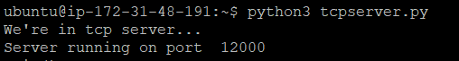

Local-machine side:

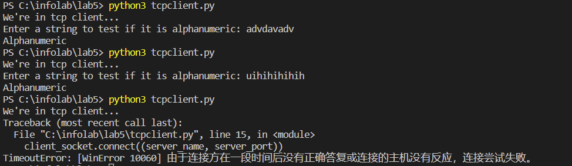

The first message is when tcp_server.py running from python script in EC2.
The second message is when tcp_server.py running as a service in EC2 with the terminal closed.
The third message is when the service is killed, tcp client cannot reach the server.

### Running TCP Server as a service
Currently, our TCP server will terminate as soon as our SSH session with the EC2 instance terminates. However, we will like to keep our server running in order to keep our application going. We can achieve this by running the tcp_server.py as a service.

1. All services are located in `/etc/systemd/system`
2. Create a file `tcpserver.service` with the following content:
```
[Unit]
Description=TCP server service
After=multi-user.target
[Service]
Type=simple
ExecStart=/usr/bin/python3 /home/ubuntu/tcpserver.py
[Install]
WantedBy=multi-user.target
```
>The multi-user.target specifications indicate when after 
the system startup this service will be executed. ExecStart flag takes in the command that you want to 
run. The first argument is the python path and the second argument is the path to the script that needs 
to be executed.
3. Move the file to the location `/etc/systemd/system` using FileZilla.
4. Lauch the service using the following lines:
```
~$ sudo systemctl daemon-reload
~$ sudo systemctl enable tcpserver.service
~$ sudo systemctl start tcpserver.service
```
This ensures that the TCP service is now running in the background as a service even after the terminal is closed until the current server is killed `~$ sudo kill -9 (process id/ found using ~$ps -ef)`

process id:

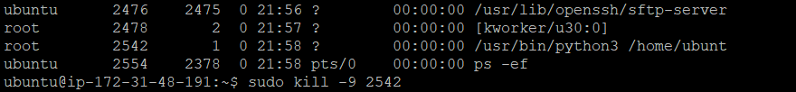

> It seems like the ps -ef instruction won't show the full execution location. The second last one on the list should be executing at the location `/user/bin/python3 /home/ubuntu/tcpserver.py` as in the service file, but due to limitation of word space, it cannot be shown fully.


### Challenge 1:
In this task, we are trying to measure the average RTT time for 500 transmissions. I modified the code on the client side to give a moving average of the RTT time.

```py
import socket
import time
print("We're in tcp client...");
#the server name and port client wishes to access
server_name = '3.8.190.35' #Public IPv4 address of the instance
#'52.205.252.164'
server_port = 12000

counter = 0
totalTime = 0
while (counter < 500):
    #create a TCP client socket
    client_socket = socket.socket(socket.AF_INET, socket.SOCK_STREAM)
    #Set up a TCP connection with the server
    #connection_socket will be assigned to this client on the server side
    client_socket.connect((server_name, server_port))
    
    msg = input("Enter an integer: ");
    start = time.time() #starts timer right before sending
        #send the message to the TCP server
    client_socket.send(msg.encode())
        #return values from the server
    msg = client_socket.recv(1024)
    stop = time.time() #stops timer right after receiving
    print(msg.decode())

    
    rtt = stop - start #logs time for this round trip
    print("Time in seconds for this Round Trip: " + str(rtt))

    totalTime += rtt
    counter += 1

    print("Moving average: " + str(totalTime/counter))
    client_socket.close()
```

In the client side, I use `time` library to measure the start and end time of each transmission (`client_socket.send` and `client socket.received`). Add the time to total time and divded it through number of transmissions. The socket is closed and reconnected in each iteration, because at the server side, it only accepts one transmission at a time.


<div id="lab6"/>

# [Lab 6](#top)
 In this lab, we will learn to write Python code to connect to a DynamoDB instance on AWS.

Boto3 is the AWS SDK for Python. It makes it easy to integrate your Python application, library, or script 
with AWS services including Amazon S3, Amazon EC2, Amazon DynamoDB, and more. In our case, we 
will use Boto3 specifically for DynamoDB. 

The following two commands should do the job:
`$ sudo apt-get update`
`$ sudo apt-get -y install python3-boto3`

### Operations in DynamoDB database

### Create Table
```py
import boto3

def create_movie_table(dynamodb=None):
    if not dynamodb:
        dynamodb = boto3.resource('dynamodb',region_name='us-east-1')

    table = dynamodb.create_table(
        TableName='Movies',
        KeySchema=[
            {
                'AttributeName': 'year',
                'KeyType': 'HASH'  # Partition key
            },
            {
                'AttributeName': 'title',
                'KeyType': 'RANGE'  # Sort key
            }
        ],
        AttributeDefinitions=[
            {
                'AttributeName': 'year',
                'AttributeType': 'N'
            },
            {
                'AttributeName': 'title',
                'AttributeType': 'S'
            },

        ],
        ProvisionedThroughput={
            'ReadCapacityUnits': 10,
            'WriteCapacityUnits': 10
        }
    )
    return table


if __name__ == '__main__':
    movie_table = create_movie_table()
    print("Table status:", movie_table.table_status)
```

- `dynamodb.create_table` has three parameters: `TableName`, `KeySchema`, `Attribute Definiations`. 

- The composite primary keys (Partition Key and Sort Key) are specified in `KeySchema`. We can insert items which have the same partition key but different sort keys, and these items will be sorted on the same partition in ascending order of the Sort Key. For each partition key, the system creates a unique hash table that stores the data.

- In `Attribute Definiations`, it specifies attributes type. 'N' is number, 'S' is string.

By running the following lines, we can se that the 'Movie' table we just created is indeed in dynamoDB.

```py
$ python3 MoviesCreateTable.py
$ python3 
>>> import boto3
>>> db = boto3.resource('dynamodb', region_name='us-east-1')
>>> print(list(db.tables.all()))
>>>exit()
```

Output:
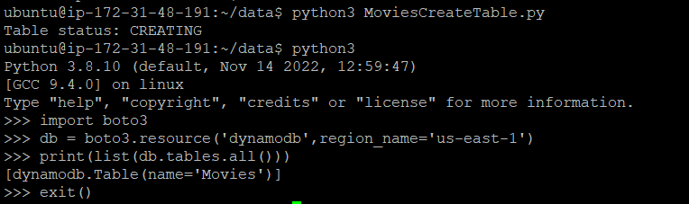

### Load sample data

We can load sample data of an existing table from JSON format at once. JSON format looks like this:
```json
{
 "year" : 2013,
 "title" : "Turn It Down, Or Else!",
 "info" : {
 "directors" : [
 "Alice Smith",
 "Bob Jones"
 ],
 "release_date" : "2013-01-18T00:00:00Z",
 "rating" : 6.2,
 "genres" : [
 "Comedy",
 "Drama"
 ],
 "image_url" : "http://ia.mediaimdb.com/images/N/O9ERWAU7FS797AJ7LU8HN09AMUP908RLlo5JF90EWR7LJKQ7@@._V1_SX400_.jpg",
 "plot" : "A rock band plays their music at high volumes, annoying the neighbors.",
 "rank" : 11,
 "running_time_secs" : 5215,
 "actors" : [
 "David Matthewman",
 "Ann Thomas",
 "Jonathan G. Neff"
 ]
 }
}
```
The year and title part are the primary key we specified while defining the table Movies. info consists of further information about the movies in JSON formation.

The following code reads the existing JSON type of moving data into MOVIE Table we just created:

```py
from decimal import Decimal
import json
import boto3
def load_movies(movies, dynamodb=None):
    if not dynamodb:
        dynamodb = boto3.resource('dynamodb', region_name='us-east-1')
    table = dynamodb.Table('Movies')
    for movie in movies:
        year = int(movie['year'])
        title = movie['title']
        print("Adding movie:", year, title)
        # put_item, putting existing items from JSON list
        table.put_item(Item=movie)
if __name__ == '__main__':
    with open("moviedata.json") as json_file:
        movie_list = json.load(json_file, parse_float=Decimal)
    load_movies(movie_list)
```
- `with open() as json_file` opens the json file.
- `json.load` read the json file as a list and store it into a list.
- `table.put_item` insert `movie` in the `movies` list.

execute: `$ python3 MoviesLoadData.py` The data is read into Table Movies.

### Create a new item
Similar to adding existing items into a table, using `put_item()`

```py
from pprint import pprint
import boto3

def put_movie(title, year, plot, rating, dynamodb=None):
    if not dynamodb:
        dynamodb = boto3.resource('dynamodb', region_name='us-east-1')

    table = dynamodb.Table('Movies')
    # put_item function
    response = table.put_item(
       Item={
            'year': year,
            'title': title,
            'info': {
                'plot': plot,
                'rating': rating
            }
        }
    )
    return response


if __name__ == '__main__':
    movie_resp = put_movie("The Big New Movie", 2015,
                           "Nothing happens at all.", 0)
    print("Put movie succeeded:")
    pprint(movie_resp)
```
Output:

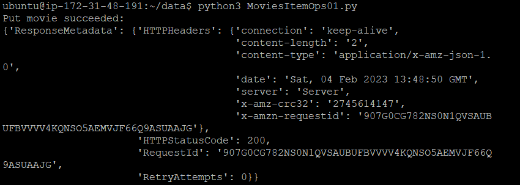

### Reading an item
An item can be read from its table using its primary key value. Use function `get_item()`. Remeber to put an error message when failing to match the primary keys. 

```py
from pprint import pprint
import boto3
from botocore.exceptions import ClientError


def get_movie(title, year, dynamodb=None):
    if not dynamodb:
        dynamodb = boto3.resource('dynamodb', region_name='us-east-1')

    table = dynamodb.Table('Movies')

    try:
        # get_item function
        response = table.get_item(Key={'year': year, 'title': title})
    except ClientError as e:
        print(e.response['Error']['Message'])
    else:
        return response['Item']


if __name__ == '__main__':
    movie = get_movie("The Big New Movie", 2015,)
    if movie:
        print("Get movie succeeded:")
        pprint(movie)
```
Output:

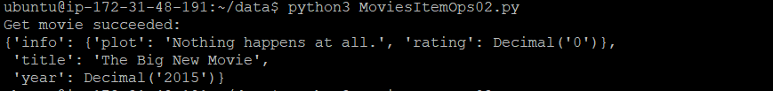

### Update an item
We use function `update_item()`.

```py
from decimal import Decimal
from pprint import pprint
import boto3


def update_movie(title, year, rating, plot, actors, dynamodb=None):
    if not dynamodb:
        dynamodb = boto3.resource('dynamodb', region_name='us-east-1')

    table = dynamodb.Table('Movies')

    response = table.update_item(
        Key={
            'year': year,
            'title': title
        },
        # write the expression including place holder
        UpdateExpression="set info.rating=:r, info.plot=:p, info.actors=:a", 
        # specify the placeholders' values
        ExpressionAttributeValues={
            ':r': Decimal(rating),
            ':p': plot,
            ':a': actors
        },
        ReturnValues="UPDATED_NEW"
    )
    return response


if __name__ == '__main__':
    update_response = update_movie(
        "The Big New Movie", 2015, 5.5, "Everything happens all at once.",
        ["Larry", "Moe", "Curly"])
    print("Update movie succeeded:")
    pprint(update_response)
```

The content assigned to `UpdateExpression` describes the changes we wish to see in the specified item. *In short, we first write the expression, which 
includes some place holders (expression attributes), such as :r, :p and :a in this case. In the ExpressionAttributeValues parameter, we specify the values of these place holders.*

Output:
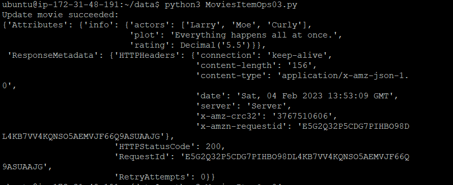

### Delete an Item
We can try to delete a specific movie item if its rating is 10 or less. Here we should use conditional statement.

```py
from decimal import Decimal
from pprint import pprint
import boto3
from botocore.exceptions import ClientError


def delete_underrated_movie(title, year, rating, dynamodb=None):
    if not dynamodb:
        dynamodb = boto3.resource('dynamodb', region_name='us-east-1')

    table = dynamodb.Table('Movies')

    try:
        response = table.delete_item(
            Key={
                'year': year,
                'title': title
            },
            ConditionExpression="info.rating <= :val", # conditional delete, specify equation
            ExpressionAttributeValues={
                ":val": Decimal(rating) # specify value
            }
        )
    except ClientError as e:
        if e.response['Error']['Code'] == "ConditionalCheckFailedException":
            print(e.response['Error']['Message'])
        else:
            raise
    else:
        return response


if __name__ == '__main__':
    print("Attempting a conditional delete...")
    delete_response = delete_underrated_movie("The Big New Movie", 2015, 10)
    if delete_response:
        print("Delete movie succeeded:")
        pprint(delete_response)
```

Notice the use of conditional delete, which is similar to previous `UpdateExpression` parameter. It first specify a equation of condition using place holder and then specify the value.

Output:
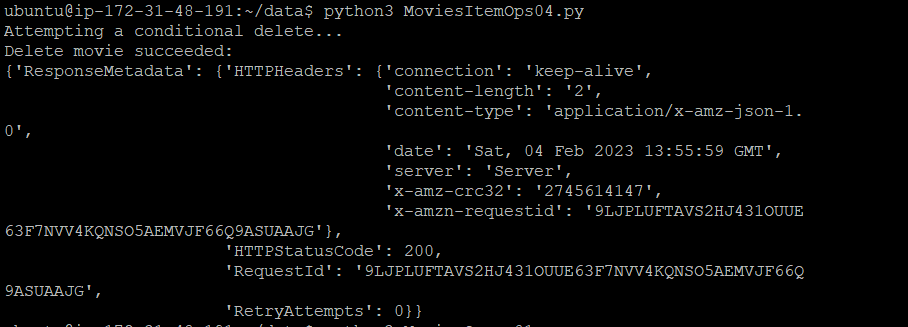

### Query the data
To query data from a specfic table, we use the query method. We must supply the partition key to the query method.

First example:
```py
import boto3
from boto3.dynamodb.conditions import Key

def query_movies(year, dynamodb=None):
    if not dynamodb:
        dynamodb = boto3.resource('dynamodb', region_name='us-east-1')

    table = dynamodb.Table('Movies')
    response = table.query(
        # KeyCondtionExpression, Key().eq(), internal library
        KeyConditionExpression=Key('year').eq(year)         
    )
    return response['Items']


if __name__ == '__main__':
    query_year = 1985
    print(f"Movies from {query_year}")
    movies = query_movies(query_year)
    for movie in movies:
        print(movie['year'], ":", movie['title'])
```
Notice the use of the parameter `KeyConditionExpression` instead of `ConditionExpression`. It specifies that this condition is comparing the key value. In addition, the Boto 3 SDK automatically constructs a ConditionExpression for you when you use the Key (or Attr) function imported from boto3.dynamodb.conditions. For example, `Key('year').eq(year)` is a equality condition from the library that can be used directly. Specifying ConditionExpression directly as a string is also possible.

Output:
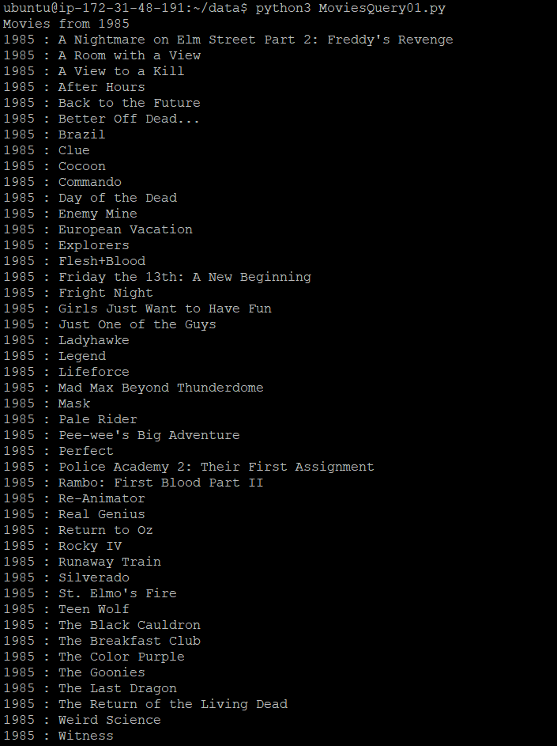

Example 2: Find movies from 1992, whose titles begin with letters A-L.

```py
from pprint import pprint
import boto3
from boto3.dynamodb.conditions import Key


def query_and_project_movies(year, title_range, dynamodb=None):
    if not dynamodb:
        dynamodb = boto3.resource('dynamodb', region_name='us-east-1')

    table = dynamodb.Table('Movies')
    print(f"Get year, title, genres, and lead actor")

    # Expression attribute names can only reference items in the projection expression.
    response = table.query(
        # ProjectionExpession, query return response format, 
        # only print year, title, genre and first actor in the list
        ProjectionExpression="#yr, title, info.genres, info.actors[0]",
        # not sure what this means
        ExpressionAttributeNames={"#yr": "year"},
        # same as before, but adding another condition 'title' between A and L
        KeyConditionExpression=
            Key('year').eq(year) & Key('title').between(title_range[0], title_range[1])
    )
    return response['Items']


if __name__ == '__main__':
    # defining query year and range, range is in a list
    query_year = 1992
    query_range = ('A', 'L')
    print(f"Get movies from {query_year} with titles from "
          f"{query_range[0]} to {query_range[1]}")
    movies = query_and_project_movies(query_year, query_range)
    for movie in movies:
        print(f"\n{movie['year']} : {movie['title']}")
        pprint(movie['info'])
```
- qurey() parameter `ProjectionExpression`: query return response format, only print year, title, genre and first actor in the list.
- qurey() parameter `ExpressionAttributeNames`: seems to be the return expression title/attribute?
> not sure
- qurey() parameter `KeyConditionExpression`: same as before, creating an conditional comparsion between year and title. Internal function including `.eq()` (equal to) and `.between` (between to value/range).

Output of the code:
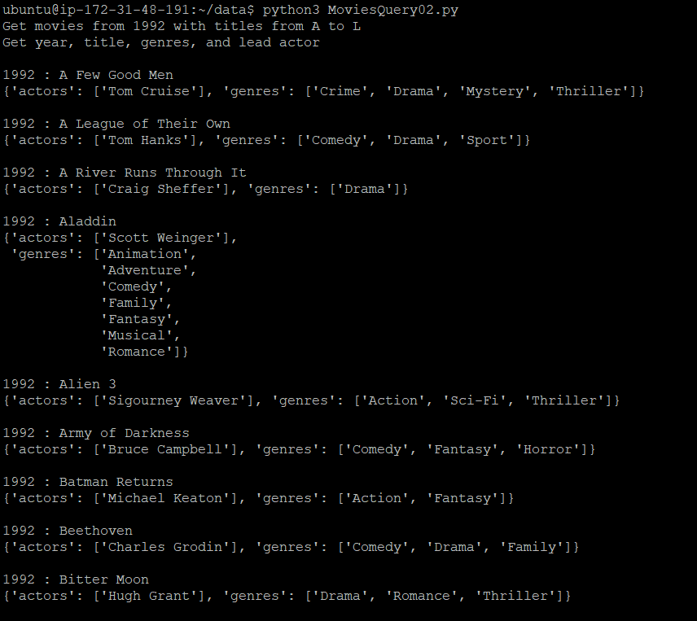

Output when removing `ProjectionExpression` and `ExpressionAttributeNames`.

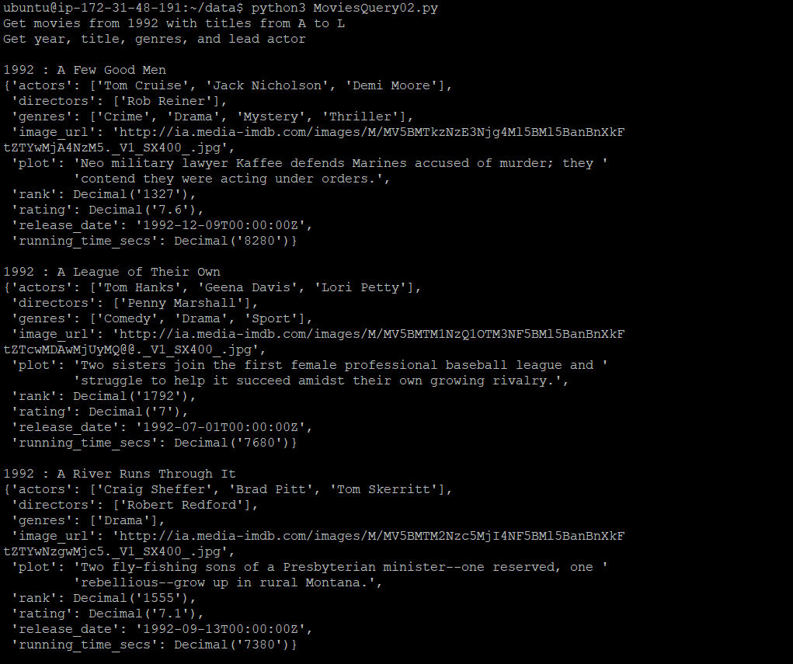

The format is clealy different, the first one return expression that only contains the information we specified in `ProjectionExpression`.

### Scan the data
The query method has the limitation that it must be supplied with a specific partition key value. If we wish to write a query that needs to fetch data from multiple partitions, we can use the scan method. It reads all the items of a table, from all the partitions, then applies a filter_expression, which you provide, and returns only the elements 
matching your criteria. For example, if we want to print all movies between year 1950 ad 1959.

```py

from pprint import pprint
import boto3
from boto3.dynamodb.conditions import Key


def scan_movies(year_range, display_movies, dynamodb=None):
    if not dynamodb:
        dynamodb = boto3.resource('dynamodb', region_name='us-east-1')

    table = dynamodb.Table('Movies')

    #scan and get the first page of results
    response = table.scan(FilterExpression=Key('year').between(year_range[0], year_range[1]));
    data = response['Items']
    display_movies(data)

    #continue while there are more pages of results
    while 'LastEvaluatedKey' in response:
        # scan() has two parameters
        response = table.scan(FilterExpression=Key('year').between(year_range[0], year_range[1]), ExclusiveStartKey=response['LastEvaluatedKey'])
        # data.extend, continues adding to data output
        data.extend(response['Items'])
        display_movies(data)

    return data

if __name__ == '__main__':
    def print_movies(movies):
        for movie in movies:
            #print(f"\n{movie['year']} : {movie['title']}")
            #pprint(movie['info'])
            pprint(movie)

    query_range = (1950, 1959)
    print(f"Scanning for movies released from {query_range[0]} to {query_range[1]}...")
    scan_movies(query_range, print_movies)
```

- scan() parameter `FilterExpression`, similar to `KeyConditionExpression`, defines the condition of filtering the data. Here we use Key().between() to print the data from 1950-1959.
- scan() parameter `ExclusiveStartKey` defines the starting point/page of scan function.  The expression ExclusiveStartKey=response['LastEvaluatedKey'] points the ExclusiveStartKey to the top of the next page, and so on.
> Reason needed for `ExclusiveStartKey`: DynamoDB applies and returns the results of queries and scans one page at a time where a page can contain at max 1MB of data. Therefore, the first call to scan returns the first page of results. The while loop then continues to re-call the scan function as along as there are more pages to filter results from. The response object maintains an attribute LastEvaluatedKey which is not None if there are more pages following the current one.

Output:
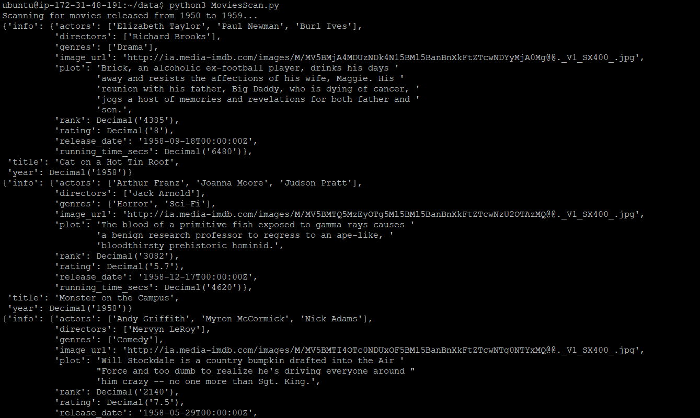

### Delete Table
```py
import boto3

def delete_movie_table(dynamodb=None):
    if not dynamodb:
        dynamodb = boto3.resource('dynamodb', region_name="us-east-1")
    # define the table that will be deleted
    table = dynamodb.Table('Movies')
    # delete the table using delete()
    table.delete()


if __name__ == '__main__':
    delete_movie_table()
    print("Movies table deleted.")
```

Output:

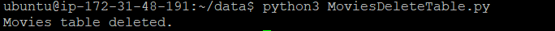


